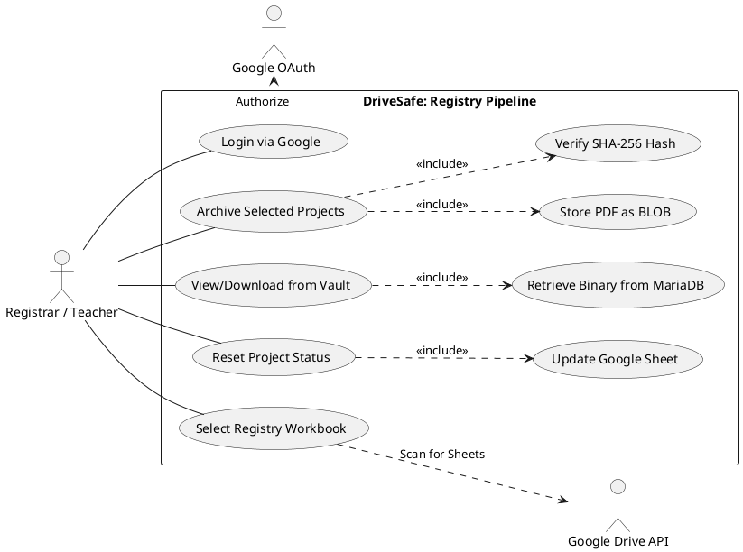
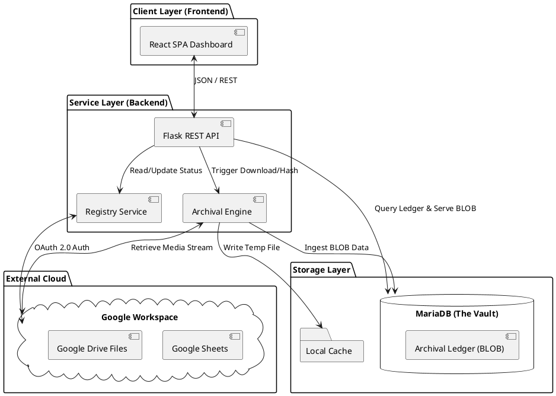
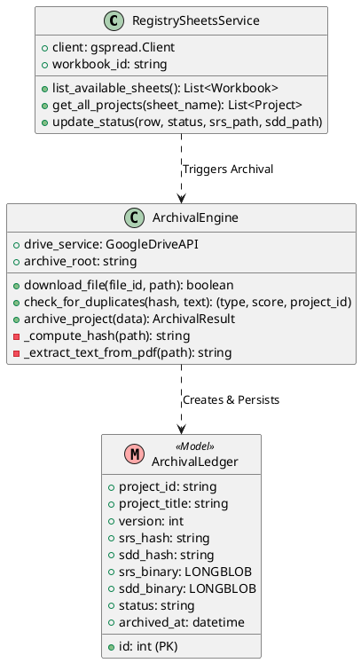

# Revised SRS & SDD Content for DriveSafe

**Prepared by:**
John Earl F. Mandawe (Lead Architect)
Clyde Nixon Jumawan
Mark Joenylle B. Cortes
Lyrech James E. Laspiñas
Louis Drey Castañeto

---

## 1. Introduction / Overall Description Updates

**Core Innovation: The Binary Vault**
Unlike traditional systems that rely on external cloud links, DriveSafe implements a Self-Sufficient Binary Vault. During the archival sequence, the system extracts the raw byte-stream of the SRS and SDD PDFs from Google Drive and injects it directly into a `LONGBLOB` column within MariaDB. This ensures the institution maintains a permanent, tamper-evident record that survives even if the original student cloud link is deleted or modified.

**Intelligent Versioning (SHA-256)**
Versioning within DriveSafe is not based on filenames or timestamps, but on Cryptographic Integrity. Every time a project is re-archived, the system calculates a SHA-256 checksum of the downloaded content. If a bit-level difference is detected (indicating a revision), the system automatically increments the version (e.g., v1 to v2) while preserving the historical record. If the hash is identical, the system blocks the duplicate to conserve storage.

**User-Level OAuth 2.0 Security**
The system utilizes dynamic User-level OAuth 2.0 integration. The application acts on behalf of the logged-in Registrar or Teacher, scanning their personal Google Drive for accessible Registry Workbooks. This prevents manual file-sharing overhead and ensures strict adherence to data privacy by only accessing files the authenticated user already has permission to view.

**Registry Pipeline & Soft-Reset**
The Registry Pipeline allows for bidirectional workflow management. Through the "Reset Status" feature, administrators can reverse an accidental archive, moving a project back to "Pending" in the Google Sheet. This "Soft-Reset" maintains the historical "Vault" records in the database for audit purposes, ensuring no data is permanently lost during workflow corrections.

---

## 2. Use Case Diagrams & Descriptions

### PlantUML Code: Use Case Diagram

### Revised Use Case Descriptions
*   **Archive Selected Projects**: The user selects pending or archived projects from the active Google Sheet. The system downloads the latest SRS and SDD files, computes their SHA-256 hashes, checks for duplicates, and if unique, saves the binary content into the MariaDB ledger as a new version.
*   **View/Download from Vault**: The user accesses the Archival Ledger to retrieve a previously archived project. The system queries the MariaDB database, extracts the `LONGBLOB` binary data, and streams it to the user's browser for either inline viewing or direct downloading, entirely independent of the original Google Drive link.
*   **Reset Project Status**: The user selects an archived or failed project and triggers a reset. The system updates the project's status in the associated Google Sheet back to "Pending", allowing for the project to be re-processed without deleting its existing historical records in the database.

---

## 3. Architectural Design

### PlantUML Code: Component Diagram

---

## 4. Detailed Class & Object Design

### PlantUML Code: Class Diagram

---

## 5. UI / Wireframe Specifications
*   **Login Interface**: Must prominently feature a "Sign in with Google" button requesting standard profile scopes alongside strict `drive` and `spreadsheets` access.
*   **Registry Dashboard**: A tabular interface displaying all projects fetched from the selected Google Sheet. It must include a dynamic dropdown for selecting the active "Workbook" (Sheet) and "Active Sheet" (Year). Each row must display the Project ID, Title, and a Status Badge. If a project has multiple versions, a "V2" or "V3" indicator must appear. A "Reset Status" action must be available for non-pending rows.
*   **Archival Ledger**: A comprehensive history view of all successful archives. Must display cryptographic SHA-256 hashes for data integrity verification. Crucially, it must include distinct "View" and "Download" buttons for both SRS and SDD documents that interface directly with the database BLOB storage.
